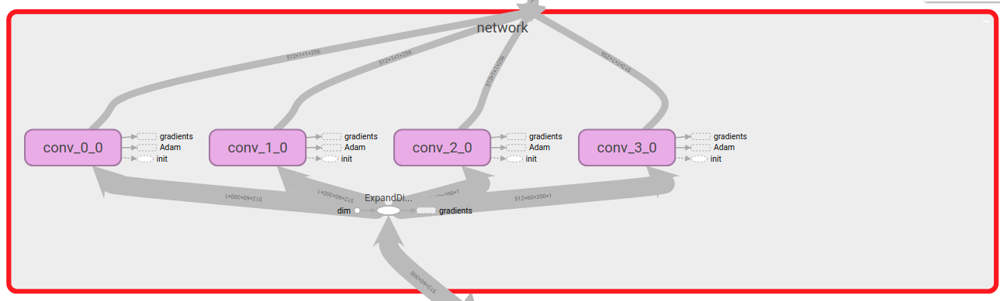

## Detecting Toxic Comments
### Introduction
A CNN model for text classification. The model is tested on a multi-label 
classification task with Wikimedia comments dataset. The model achieved an 
AUROC of 0.89 with word embeddings trained simultaneously; with FastText, 
the AUC is 0.97 with Kim Yoon's CNN, and 0.98 with a 2-layer LSTM.

### Usage
To train with default layer configurations
```bash
python training/train.py --data dataset.csv --vocab 30000 --embedding 300 --mode cnn
```
where vocab flag is for specifying vocabulary size and embedding embedding 
size. There are three modes: use 'cnn' for training CNN for 
classification, 'lstm' for training LSTM for classification, 'emb' for training word embeddings, and 'test' for testing
a trained model.

You can also change the layer configuration if you decide to write your 
own code for training and testing, by providing values to `layer_config` 
and `fully_conn_config` attributes to the ToxicityCNN object. `layer_config` 
is a list and follows the structure: 
```
[
    [
        # Parellel layer 1
        [ksize, stride, out_channels, pool_ksize, pool_stride],
    ],
    [
        # Parellel layer 2
        [ksize, stride, out_channels, pool_ksize, pool_stride],
    ],
]
```
For Example, a configuration like this:
```pythonstub
[
    # Convolution layer configuration
    # ksize, stride, out_channels, pool_ksize, pool_stride
    [
        [2, 1, 256, 59, 1],
    ],
    [
        [3, 1, 256, 58, 1],
    ],
    [
        [4, 1, 256, 57, 1],
    ],
    [
        [5, 1, 256, 56, 1],
    ],
]
```
represents a structure like this:
